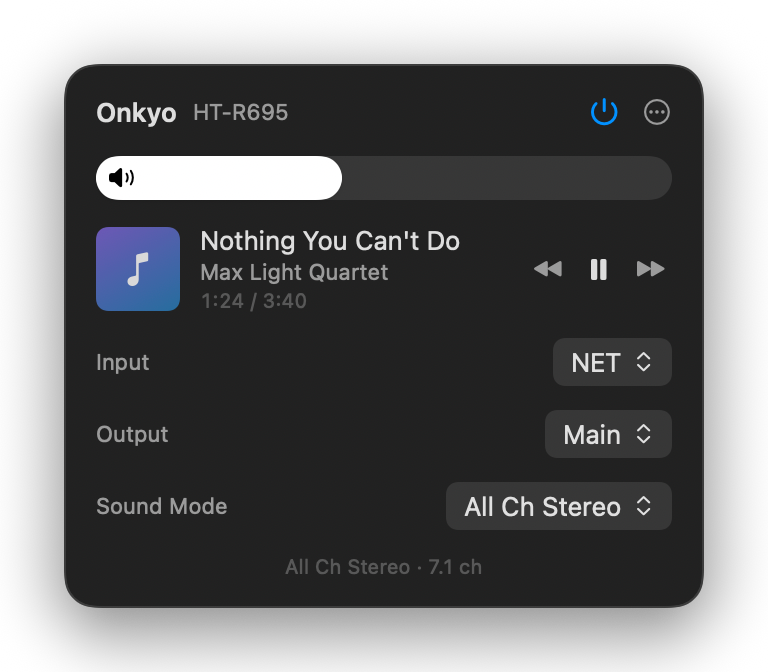

<div align="center">


# OnkyoMac

**Onkyo receiver control that feels built into macOS.**

A tiny native menu bar app for your Onkyo AV receiver — power, volume, inputs, HDMI
output routing, sound modes and live now-playing, styled like Control Center. No cloud,
no account, no Electron. One sub-megabyte binary talking straight to the receiver.

[](https://github.com/inakizamores/OnkyoMac/releases/latest)
[](https://github.com/inakizamores/OnkyoMac/releases)
[](#requirements)
[](#requirements)
[](Sources/OnkyoMac)
[](LICENSE)

<br>



</div>

---

## Install

**[⬇ Download OnkyoMac.dmg](https://github.com/inakizamores/OnkyoMac/releases/latest/download/OnkyoMac.dmg)**, open it, drag **OnkyoMac** onto **Applications**, and launch it from there. The receiver icon appears in your menu bar.

Prefer the Terminal? This installs and launches it in one line, no dialogs:

```bash
curl -fsSL -o /tmp/OnkyoMac.zip https://github.com/inakizamores/OnkyoMac/releases/latest/download/OnkyoMac.zip && ditto -xk /tmp/OnkyoMac.zip /Applications && xattr -dr com.apple.quarantine /Applications/OnkyoMac.app && open /Applications/OnkyoMac.app
```

### First launch — telling macOS to trust the app

OnkyoMac is open source and **not notarized by Apple** (notarization requires a paid
Apple Developer subscription). macOS therefore warns you once. This is expected — here's
the official Apple flow to approve it:

1. Double-click **OnkyoMac** in Applications. macOS shows *"Apple could not verify
   OnkyoMac is free of malware"* — click **Done** (not *Move to Trash*).
2. Open **System Settings → Privacy & Security**.
3. Scroll down to the Security section — you'll see *"OnkyoMac was blocked to protect
   your Mac"*. Click **Open Anyway**.
4. Confirm with your password or Touch ID. macOS remembers the decision permanently.

Skeptical? Good instinct. The entire app is in this repository — you can read every line
and [build it yourself](#build-from-source) in under a minute.

### Local Network permission

On first open of the panel, macOS asks for **Local Network** access. Click **Allow** —
that's how OnkyoMac discovers and controls the receiver. That's the entire setup.

## Features

- ⚡ **Power** — on and off from the menu bar; works from network standby, and the app
  re-reads everything across the receiver's boot window so levels are always true
- 🎚️ **Volume & mute** — Control-Center-style capsule bar; click the speaker glyph to
  mute, and the glyph's waves track the level
- 🎛️ **Inputs, by their real names** — the picker asks the receiver for its own input
  list, so it shows exactly what the front panel shows (STRM BOX, BD/DVD, custom
  renames…), on any model
- 📺 **HDMI output routing** — Main / Sub / Main + Sub, for TV-vs-projector setups
- 🎵 **Now Playing** — title, artist, album art and live progress for Network, Bluetooth
  and USB sources, with play/pause/skip; updates are pushed by the receiver in real time
- 🔊 **Sound modes** — Stereo, Direct, All Ch Stereo, Theater-Dimensional, Full Mono,
  Dolby Surround, DTS Neural:X
- ℹ️ **Format readout** — a subtle line showing what's actually happening:
  incoming codec → active sound mode → output channels
- 🚀 **Start at Login** — always ready, never in your Dock
- ⚡ **Instant panel** — renders fully populated from last-known state the moment it
  opens; fresh values glide in behind

## Everyday use

| Gesture | Effect |
|---|---|
| Click menu bar icon | Open the panel |
| Power button | Receiver on / off (network standby) |
| Drag the volume bar | Set level (tracks 1:1) |
| Two-finger swipe on the bar | Nudge level — damped so it can never jump |
| Click the speaker glyph | Mute / unmute |
| Input / Output / Sound Mode | Native pickers, applied instantly |
| ⋯ menu | Start at Login · Rescan Network · Quit |

## How it works

- Speaks **eISCP** (Integra Serial Control Protocol) over TCP port 60128 — the same
  protocol Onkyo/Integra ship for professional control systems
- The receiver **pushes** every state change to the app, so turning the physical volume
  knob moves the bar live — there is no polling at all
- Discovery by UDP broadcast, with the receiver's address cached for instant reconnects
- Connects only while the panel is open; closed, the app does nothing
- Pure Swift + SwiftUI `MenuBarExtra`. Zero third-party dependencies. Single arm64 binary.

## Privacy

Everything stays on your LAN. OnkyoMac connects to nothing but the receiver. No
analytics, no telemetry, no accounts.

## Requirements

- macOS 14 Sonoma or later, Apple Silicon
- A network-connected **Onkyo / Integra** receiver speaking eISCP (most models since
  ~2011; recent **Pioneer** AVRs speak it too). Developed and tested against an Onkyo
  HT-R695 — controls a given model doesn't support are simply ignored by it
- **Network Standby** enabled on the receiver if you want power-on to work while it's off
  (Setup → Hardware → Network → Network Standby)

## Troubleshooting

- **No receiver found** — confirm the receiver has network standby on and is on the same
  network, check **System Settings → Privacy & Security → Local Network** has OnkyoMac
  enabled, then **⋯ → Rescan Network**.
- **Input names look generic** — **Rescan Network** re-fetches the receiver's own input
  list (also picks up renames).
- **Power-on does nothing** — enable Network Standby on the receiver; without it the
  receiver's network port sleeps when the unit is off.

## Build from source

Only Xcode Command Line Tools required (`xcode-select --install`) — no Xcode, no
dependencies:

```bash
git clone https://github.com/inakizamores/OnkyoMac.git
cd OnkyoMac
./build.sh --install
```

`./build.sh` produces `build/OnkyoMac.app`; `--install` copies it to /Applications and
launches it. `./release.sh` builds the distributable DMG and zip. Tagged `v*` pushes are
built and published automatically by GitHub Actions on macOS 26 runners (the workflow
refuses to ship a build linked against an older SDK, which would render with legacy
window chrome).

## Sibling project

Control a Sonos system the same way: **[SonoMac](https://github.com/inakizamores/SonoMac)** —
same design, same philosophy, Sonos's local UPnP protocol.

## License

[MIT](LICENSE) — do whatever you like with it.
